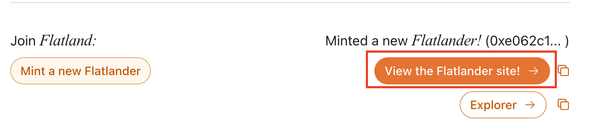
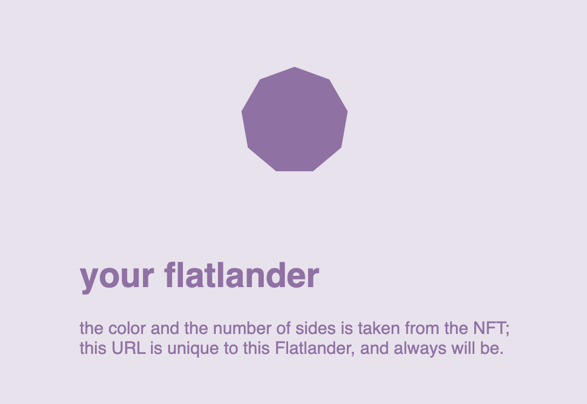

# Flatland
A demo for a dApp on Walrus Sites, with minting and per-NFT sites.

## Repo structure

### `mint-site`
The dApp Walrus Site that mints the NFTs. You can see the site at https://flatland.wal.app.
To mint the NFT, you need to connect your wallet and set the wallet's network to `Testnet`

You will need to faucet some testnet tokens to mint the NFT. To mint the NFT, click on `Mint a new Flatlander`

Once you mint the NFT, you will see a link to the `nft-viz` site.

### `nft-viz`
This site is linked from the minting site, and is also linked from the NFTs Display standard.
Once you click on the link from the minting site, you will be taken to the `nft-viz` site. This site is unique for each NFT.

You can read more about how the redirects work at <https://docs.wal.app/walrus-sites/redirects.html>.

### `move/flatland`
The contract code for minting the NFTs.
