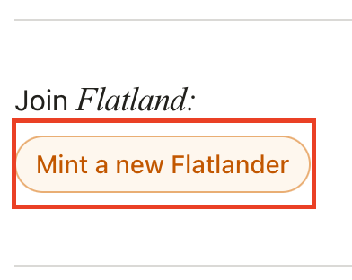

# Flatland
A demo for a dApp on Walrus Sites, with minting and per-NFT sites.

### `mint-site`
The dApp Walrus Site that mints the NFTs. You can see the site at https://flatland.wal.app.
To mint the NFT, you need to connect your wallet and set the wallet's network to `Testnet`

You will need to faucet some testnet tokens to mint the NFT. To mint the NFT, click on `Mint a new Flatlander`

Once minted, you can visualize the NFT in the site.

